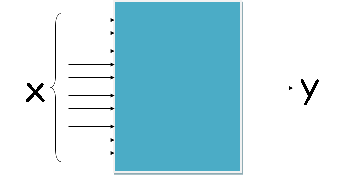

# titanic
A Titanic problem is used to demonstrate how to use three important functions in machine learning where pandas, preprocessing, and train_test_split are detailed.
The goal of machine learning is to create input-output function f: y=f(X) where y and X are output and inputs respectively. We would like to predict y values using X values by forming function f.

----------------------------
titanic.csv is a dataset with 13 parameters (row.names,pclass,survived,name,age,embarked,home.dest,room,ticket,boat,sex). "survive" is the output y to be predicted and 12 parameters are inputs X. pandas is a library to import titanic.csv data in Python:
<pre>
import pandas as pd
titanic=pd.read_csv('titanic.csv',encoding="shift-jis")
</pre>

Machine learning algoritms can take care of only numbers. Therefore, if the dataset contains non-numeric value (string), all strings must be converted into numbers by the followinig three lines:
<pre>
from sklearn import preprocessing
le = preprocessing.LabelEncoder()
titanic=titanic.apply(le.fit_transform)
</pre>
The following two lines fills empty data in age with mean.
<pre>
mean=titanic['age'].mean()
titanic['age'].fillna(mean,inplace=True)
</pre>
---------------------------

train_test_split is a function to split the dataset X (inputs) and y (output) into X_train,X_test,y_train,y_test respectively. This example shows 0.2 for testing data, therefore 0.8 for training data. shuffle=True means shuffling data.
<pre>
titanic_target = titanic['survived']
titanic_data=titanic.drop(['survived'],axis=1)
X_train,X_test,y_train,y_test=train_test_split(titanic_data,titanic_target,test_size=0.2,random_state=54,shuffle=True)
</pre>
--------------------------

There are two kinds of machine learning:classifier and regressor. Classifier deals with discrete numbers while regressor with continuous numbers. Two ensemble machine learning algorithms are introduced: randomforest and extratrees. To run machine learning, type the following command:
<pre>
$ python ext_titanic.py
or
$ python randf_titanic.py
</pre>

The following three lines show feature of importances in more important order.
<pre>
dic=dict(zip(titanic_data.columns,clf.feature_importances_))
for item in sorted(dic.items(), key=lambda x: x[1], reverse=True):
 print(item[0],round(item[1],4))
</pre>

You must install pandas and scikit-learn (sklearn) in your system. To install libraries, you can use conda or pip command.

In order to install conda, download one of the following files from the site:

https://conda.io/miniconda.html

I have tested Python3.7.

# exercises for students
<pre>
1. Make a randomforestclass program using titanic1.csv
Hints
A. Check the first line in titanic2.csv file.
B. Based on the parameters, you should modify randf_titanic.py.

</pre>
